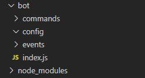

So you've got a good sense of how NodeJS operates, and how the basics of JS work. **Congrats!** Now if you are here, I assume you are ready for more advanced topics. 

That being said there are some notes I'd like to get out of the way...
- These may not all make sense at first read
- **Read** the explainations and code comments
- If you still have questions, feel free to message me over Discord @ `TheOnlyKirb#0345`
- For more community help, I recommend the `#development` channel in the [Watchpost Discord](https://discord.gg/k3kr6ED)

**Furthermore** if you haven't setup your development environment, or don't have a bot application on Discord - please refer to the [Basic Bot Tutorial](/code/topics/discordjs/basicbot). As it goes through how to get setup.
___
## Creating a Configuration File & Basic File Tree
One of the first things you should do before setting up a bot, is create a JSON configuration file to include things such as your bots prefix, token, and other important details/credentials.

For this tutorial we will be using the simple JSON file layout below.
```json
{
    "token": "Your_BotToken_Here",
    "prefix": "Your_Prefix_Here"
}
```
**Now** that you have a configuration file, it's time to make a basic file tree to handle organization as we move forward.

I recommend a layout like below, and this is the layout I will be using for this tutorial. 



- You should have at least a main housing holder, that contains a `commands`, `events`, and `configuration` folder. With a launching point file such as `index.js` in the main housing folder.
- It is also recommended that you leave the folders name lowercase, as it makes sure they are case-insensitive later on.

___

## Making the Client
We first need to create the client before we can do anything! Discord.JS provides a very easy API method to do this.
- We will also be requiring our configuration file made above.
- Go ahead and require `fs`, it will be used to read directories later on.
```js
const Client = new Discord.Client({
    fetchAllMembers: false,
    disableEveryone: true,
    disabledEvents: [],
    http: { api: 'https://discordapp.com/api', version: 7 },
    shardCount: 1
});
const fs = require("fs");
Client.config = require("./config/config.json") // Import config file and attach it to the Client
```
I'll be using `Client` as the Client variable for this tutorial. We provided a set of settings for the Client, let's go over what those are and do.

`fetchAllMembers` - If set to true, it gets all members in every guild the bot is connected to at startup.
> It's not recommended to set this to true, because you will most likely not need every member cached.

`disableEveryone` - Ensures the bot cannot unintentionally ping @everyone
`disabledEvents` - Disables events that the Client does not need. A list of events can be found [here](https://discord.js.org/#/docs/main/stable/typedef/WSEventType)
`http` - Not entirely needed, but it sets the api route and version.
`shardCount` - Specifies the # of shards you'd like to launch.
> Sharding is important as you prepare to reach 2,500 guilds! A tutorial will be posted later on proper sharding.
___

## Event Handling
So you have a client now, but how do you make it so that commands and events are run in their own files/folders?
Let's find out shall we?

First we should understand what we have to do. We have to allow Discord.JS to mark the files to run on an event. This means we have to loop through the files and provide the bot with instructions to "handle" them, in other words, we have to tell the bot when to run the files. We will be utilizing node's built in [File System](https://nodejs.org/api/fs.html) module, which we required earlier on. For info on what each part does, read the code comments!

```js
fs.readdir("./events/", (err, files) => { // reads the directory/folder
    if (err) return console.error(err) // optional: log the error
    files.forEach(file => { // loops through the files in the directory/folder
        let eventFunction = require(`./events/${file}`); // grabs the file
        let eventName = file.split(".")[0]; // gets the event name from the file name by removing the extention
        Client.on(eventName, (...args) => eventFunction.run(Client, ...args)); // sets the bot to run the event file on event recieved, and pass in the client
    });
});
```
Once that has been added into `index.js` you can now create an event file in your events folder. Let's start by making a simple `ready.js` file in your events folder! This way when the bot emits a ready event once it has connected to Discord you can run some code!

For simplicity we will only set the bots status. In ready.js write the following code
```js
exports.run = async (Client) => { // on event run, take the client we passed in earlier and use it
Client.user.setActivity("I'm Alive!") // on ready, it will change the bots status to "I'm Alive!"
}
```
This exports the inner code to be run on an event! It's what is used to run in the event handler above, specifically `eventFunction.run()`
With that, you should be set for using different events. It is important to note that certain events have their own information passed in, such as the `messageAddReaction` event which contains the reaction information. To take this data, simply add it next to the Client variable being used, such as `[...] async (Client, reaction) => [...]`
___
## Command Handling
Once you have events setup, you should get ready to add commands, but we need to be able to run commands from different files and directories! And that is where command handling comes in.

Underneath the configuration variable from earlier, add the following code.
```js
Client.commands = new Map(); // creates a map to store commands in
Client.aliases = new Map(); // does the same, but for aliases
```
This adds `.commands` and `.aliases` to the client so they can be accessed anywhere the Client is, giving us an easy way to manipulate and run commands. For more information on Maps check out [this MDN link](https://developer.mozilla.org/en-US/docs/Web/JavaScript/Reference/Global_Objects/Map).

From here, we need to add the same thing we did with events, but for commands. In this tutorial I will be assuming categories/subfolders will exist in the commands folder for easy organization of commands. For example, `./commands/fun` or `./commands/general`.

Let's go ahead and go over the command export structure before we set the commands.
```js
exports.run = async (Client, message, args) => { // since commands will be run from the message event, pass in the Client, Message, and user Arguments
   //... Code Here
}
exports.help = {
    name: 'Command Name',
    aliases: [],
    category: 'Category Name'
    description: 'Command Description'
};
```
`exports.run` is exporting the actual code that will be run on a command call, while `exports.help` is exporting the command data for the help command, and command identification.

Now that we know the command structure, we can set the commands like we did with the events! Do note, normally you wouldn't want to have this many nested loops, but in this case it is practical.

```js
fs.readdir("./commands", (err, categories) => {
    if (err) return console.error(err) // Log error to console
    if (!categories) return console.log('No categories found!')
    categories.forEach(category => { // The categories are organized by fs as an array, so loop through them.
        fs.readdir(`./commands/${category}`, (err2, commands) => { // Read the commands in each category
            if (err2) return console.error(err2)
            let files = commands.filter(f => f.split('.').pop() === 'js') // only set javascript files!
            if (!files) return console.info(`No commands found in the ${category} category!`)
            files.forEach(filename => { // for each command file do the following
                try {
                    let props = require(`./commands/${category}/${filename}`) // Require the file so we can use it's exports
                    Client.commands.set(props.help.name, props) // Set the command contents in the map we made earlier
                    props.help.aliases.forEach(alias => { // loop through the alias names and set them in the alias map
                        Client.aliases.set(alias, props.help.name) // set the alias name with the main command name
                    })
                } catch (err3) { console.error(err3) } // if there is an error with setting the command, log it here
            })
        })
    })
})
```
The above code first begins by reading the base command directory, it looks to find any subfolders or "categories" of commands. When finished, there will be an array of folder names, the categories- which are then read for commands. Each category has its inner commands required, and then set to the map we made earlier. If something fails, it is within a try catch statement that will log the error.
___
## Running Commands in the Message Event
To get started, we need to make a `message.js` event file in our events folder. This is the file the bot will run when the message event is fired off.

Let's create it with the following structure
```js
exports.run = (Client, message) => { // pass in the client, and message event details
//... Code Here
}
```
This means we can now access the message and the Client from the event file, these are passed into the file via the event handler we made earlier! Nice right?!

From here, we want to add a few important things.
- Ignore other Bots messages (and itself!)
- Ignore messages in DMs
- Ignore commands if the guild is unavailable, or partically unavailable

To do those, we need to add the following line into the event file
```js
if (!message.guild || message.IsPrivate || message.author.bot) return;
```

Now, we only want the bot to respond to prefixed commands, OR commands being used when pinged. So let's add that. We already have the config setup, so we just need an array to check if the prefix is correct. To do this, add the following.
```js
const prefix = [Client.config.prefix, `<@${Client.user.id}>`].find(p => message.content.toLowerCase().indexOf(p) === 0) // searches for the prefix position in the message content
if(!prefix) return; // if the prefix wasn't matching those in the array, return.
```

Cool! Now the bot will only respond if the prefix is attached behind the command. Like `!help` for example. But now we need to be able to get the command name or alias name, and check if it exists- and if it does, run it!

To do this, we need to break the command off of the prefix by spliting the message content into an array. Go ahead and add the following code to do this.

```js
const args = message.content.slice(prefix.length).trim().split(/ +/g) // take off the prefix from the message, and split the user input into an array.
const command = args.shift().toLowerCase(); // grab the first bit of user input.
command = Client.commands.has(command) ? command = Client.commands.get(command) : Client.aliases.has(command) ? command = Client.commands.get(Client.aliases.get(command)) : command = null
// if the commands map or aliases map has the command, set command = to the command, if not, set it to null.
if(!command) return; // if the command doesn't have an actual function return.
command.run(Client, message, args).catch(error => { // run the command, if error, log it.
    if(error) return console.error(error)
})
```
The above code begins by taking the user input and breaking it up, removing the prefix. This then leaves you with mutatable user input which is split into an array of arguments, hence the variables name `args`. We then ensure the first argument is made into the command, removing it from the array and converting it to lowercase format. From here we are then checking if the commands map we made earlier contains the command, or if there is an alias that matches. If a command is found, it updates the command variable with the command exports/data and runs the command, if there is not a command found, it returns.

Your final message.js event should look like this!
```js
exports.run = (Client, message) => {
    if (!message.guild || message.IsPrivate || message.author.bot) return;
    const prefix = [Client.config.prefix, `<@${Client.user.id}>`].find(p => message.content.toLowerCase().indexOf(p) === 0)
    if(!prefix) return;
    const args = message.content.slice(prefix.length).trim().split(/ +/g)
    const command = args.shift().toLowerCase();
    command = (Client.commands.has(command)) command = Client.commands.get(command) : Client.aliases.has(command) Client.commands.get(Client.aliases.get(command)) : command = null)
    if(!command) return;
    command.run(bot, message, args).catch(error => {
        if(error) return console.error(error)
    })
}
```
___
## Creating a Ping Command
Now that we have the ability to run commands, we need a command to be able to run! Let's make a simple ping command to make sure everything works. Here is a basic ping command to copy into a `ping.js` file. If you haven't yet, make a folder in commands called `general` and put the `ping.js` file inside. This way it will be categorized into the general category for organization.

```js
exports.run = async (Client, message, args) => {
    return message.channel.send(`:ping_pong: ${Math.floor(Client.ws.ping)}ms`)
}

exports.help = {
    name: 'ping',
    aliases: ['pong'],
    category: 'general',
    description: 'Ping pong!'
};
```

Now that you have one command, go back to your `index.js` file and let's set the bot up to log in! This way we can test what we have done so far.

Under all of the code in `index.js` lets add the following.
```js
Client.login(Client.config.token)
```

This will log the bot into Discord! The following should happen if you have followed along so far:
- It will log in without error (I hope)
- A status will appear on the bot
- It will respond to `<prefix>ping`

Go ahead and try to run the ping command once it is launched. If it worked, **great!** if not, **it's okay**, try going back over the code posted and make sure it is all correct. If that still doesn't seem to help, make sure you read the error to see what went wrong. Typos happen, and **will** break your code!
___

## Creating a Help Command

Because of the bots structure, it becomes very easy to add an intuitive help command.
- Note: This command is a bit complex, if it seems hard to understand at first, read the comments!
- You must place this *inside* a command export.

```js
const Discord = require("discord.js")
let categories = new Map(), embed = new Discord.MessageEmbed(), commandSpecific = null; // set the variables
Client.commands.forEach(command => { // loop through the commands
    if (!categories.get(command.help.category)) { // if the category doesnt exist in the map, set it
        categories.set(command.help.category, {
            commands: [] // include a commands segment
        })
    }
    categories.get(command.help.category).commands.push(command.help) //push the commands into the Map
})
embed // create a base embed
    .setTitle("Help")
    .setDescription(`Specific Category: \`${Client.config.prefix}help [category]\`\nSpecific Command: \`${Client.config.prefix}help i [command]\``)
    .setColor("RANDOM")
Array.from(categories).forEach(category => { // loop through the available categories, convert the map to array format
    let commands = "" // must be outside of the 
    category[1].commands.forEach(command => { // loop through the commands in the category
        if (args[0] && args[0].toLowerCase() === "i" && args[1] && args[1].toLowerCase() === command.name.toLowerCase()) commandSpecific = command;
        // if they are searching for a specific command, set the commandSpecific variable otherwise, list out
        commands += `\`${command.name}\` `
    })
    if (!args[0] || args[0].toLowerCase() === category[0].toLowerCase()) embed.addField(category[0].substr(0, 1).toUpperCase() + category[0].substr(1), `${commands}`, false)
    // if they aren't searching for a command, or are getting a specific category or all categories, list them
    })
if (commandSpecific) { // if there is a specific command found, handle it
let aliasList = ""
commandSpecific.aliases.forEach(aliases => { // loop through the specific commands aliases
    aliasList += `\`${aliases}\` `
})
embed.addField(`Command Description - ${commandSpecific.name.substr(0, 1).toUpperCase() + commandSpecific.name.substr(1)}`, `${commandSpecific.description}\n`) 
// add a command description and alias list
if (aliasList !== "") embed.addField(`Available Aliases`, `${aliasList}`)
}
// if nothing was added to the embed, nothing was found.
if (embed.fields.length === 0) embed.addField("Nothing Found", `Your search parameters returned no results.`)
//send the message
message.channel.send(embed)
```
This command allows a user to query specific commands, specific categories, and view all categories at one time. Play around with it if it doesn't make a lot of sense, and **please** read the code comments! They are there to help you.
___

## Conclusion

With this you should now have a fully functional bot that has command category folders, event and command handling, a ping command, and a help command. Along with this you have the two most basic events, `message` and `ready` that you can modify if you'd like.

As always, if you are here to **just** copy code, you **will not learn**. As some final words on this tutorial, if you do not try and learn from the code posted, you will not get far. Mess around with the code, fiddle, see how to break it, do whatever you need to do to learn - but make sure you are learning, not just pressing `CTRL+C` and `CTRL+V`.
