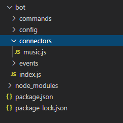
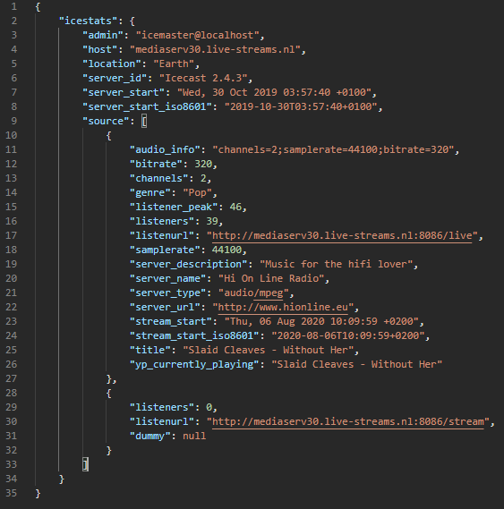
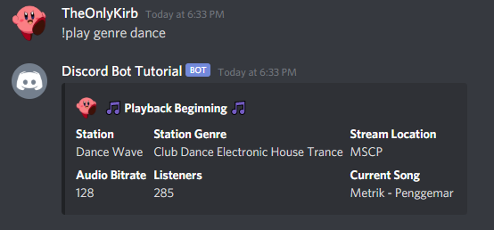
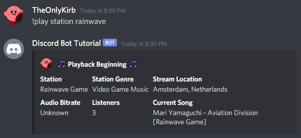
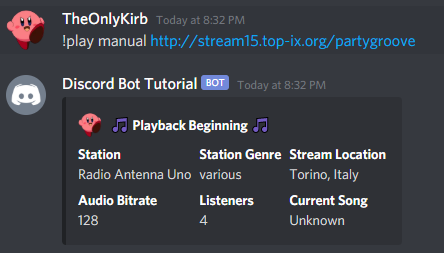
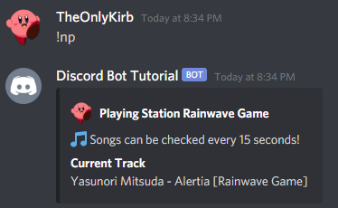
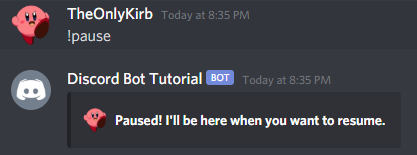
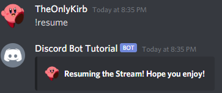
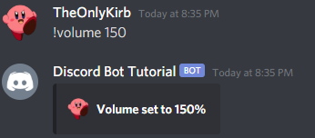

## Welcome!
In this tutorial we take the code from the [Advanced Bot Tutorial](/code/topics/discordjs/advancedbot) and add onto it to create a Music feature set. 

It is entirely possible to integrate this code into a bot that doesn't follow the tutorial, in fact- it's been written to explain very clearly where the files and code should go - however it may still be helpful to view the Advanced Bot Tutorial to ensure your bot is setup in a proper way, or so that you understand where the tutorial is referencing.

**Note** This is a music bot that does **not** use youtube. Music bots that use youtube break the youtube terms of service, and stream copyrighted content that was posted in video format. This is not something I wish to promote. Youtube will ban IP addresses of bots that do this. Larger music bots utilize a system of rotating IPv6 addresses to get around these blocks, which can become expensive, and by doing this they are knowingly breaking the terms of service. I do not condone this type of behavior, and as such will not be creating a tutorial based around youtube for specific song playback.

**Without** further ado, let's get into it!
___
## Prerequisites
There are a few modules we need to install with NPM first, we need [FFmpeg](https://www.npmjs.com/package/ffmpeg)\*, [Fluent-ffmpeg](https://www.npmjs.com/package/fluent-ffmpeg), and lastly, [@discord.js/opus](https://www.npmjs.com/package/@discordjs/opus)

You can install them all with 
```bash
npm install ffmpeg fluent-ffmpeg @discordjs/opus --save
```

Now we must ensure FFmpeg is installed on the OS the bot is running on. For Debian based Linux Distros it is as easy as doing `sudo apt install ffmpeg` but for Windows users it is a bit more complicated.

For windows users you must first download FFmpeg from [the official downloads page](https://ffmpeg.zeranoe.com/builds/).
From here you must do the following to ensure FFmpeg is registered
- Extract the download into a location of your choice
- Rename the extracted folder to `FFmpeg` for clarity
- Go to `Control Panel > System and Security > System > Advanced System Settings`
- From here, click on `Environment Variables` in the Advanced Settings window
- Double click on the `Path` value in the table shown
- Click `new` to add a new variable to the path
- Add your FFmpeg folder path into the table and click `ok`
- Restart your command line/terminal, and FFmpeg should be installed!

Once FFmpeg is installed, you should be all set to move on!
___
## Bot Setup
We will need to add some new properties to the Client. To do this in a clean and future proof way, we will be storing the properties in a separate file, and requiring them in the `index.js` file we created in the Advanced Bot. For those not following from that tutorial, this should be the launching point for your bot, or where you store the Client creation and login.

To do this we should create a new folder under `/bot/connectors`, in other words, create a folder called `connectors` under the main folder for your bot. Make sure it is outside the commands and events folder!

Once you have done that, we need to create a `music.js` file to store the properties in. For this tutorial, we will use the following code in the `music.js` file. 
Note: You will see some functions below, we will use this later on in the tutorial. For now, just keep them in this file for future use! They will be explained later.
```js
module.exports = (Client) => {
    Client.music = {} // base object
    Client.music.stations = [] // array of stations available
    Client.music.servers = new Map() // a Map to store server data/settings
    Client.music.getStation = async function getStation(station) {
        // this will get the station/stream info
    }
    Client.music.servers.recordPlayback = function tracker(data, station, info) {
        // this will set the servers map when playback begins or changes
    }
    Client.music.servers.play = async function playStation(station, message) {
        // this will contain the play functionality
    }
}
```
This code ensures we can use `require` to attach the properties and functions to the Client. We will have a queue Map, a servers Map, and a stations array to hold data. Along with this we will have **three* very important functions for the future that allow for proper playback!

Once you have the `music.js` file setup, we should go ahead and require it to "connect" it to the Client. Inside your `index.js` file place the following code
```js
require("./connectors/music.js")(Client)
```
This passes in the Client to the `music.js` file! Now your properties and functions exist on the bot and we can continue!

For reference, your folder structure should look something like this in the end.

___
## Ready Event / Station Fetching
**Before** we can get started, we will need to fetch the list of stations that the bot can play. This will allow us to sort by genre, and station in the later commands. For this tutorial we will be using a constantly updated list of stations that I curate on this site. That is the JSON structure we will be working with as well. If you would prefer to selfhost this list, you absolutely can, but remember to update this event with the correct URL to hit on ready.

The link to my stations list is `https://ajnicoloff.me/code/stationlist/index.json`

To get the JSON we will need to use and require the `node-fetch` module. We will also be setting up the stations array for the future by mapping the json response. Let's go ahead and do that. Inside your `ready` event, let's use the following code. Do note, if your ready event is not asyncronous, it needs to be.
```js
const fetch = require("node-fetch") // require the module
    await fetch("https://ajnicoloff.me/code/stationlist/index.json")
        .then(res => res.json())
        .then(json => {
            // set the stations array for use while the bot is online
            Client.music.stations = json.map(stream => [stream.name, stream.url, stream.statspos, stream.genre, stream.website, stream.donate, stream.description, stream.outdated])
    })
```
Let's go over what we did to set the array up. We mapped the stream name, url, statistic position, genre, website, donation website, stream description, AND whether or not the station is outdated into a nice array. That's a lot! But it's all information you will need. Let's break it down.
- Stream Name / Radio Station Name
- URL of the Stream
- Position to read from the stations source*
- The station Genre
- Station website
- Donation website,
- Station description
- If the station is outdated

These are all important to know and will be used in the commands we create!
*Position - When we fetch a stream we obtain the stations status page which is in JSON format, with an array for each audio stream. The position listed in this gives us the proper array position to grab, as some stations have multiple streams going and multiple array positions!

With that, you should be all set to move onto the commands!
___
## Play by Genre | Play Command [1/4]
**Note** This section includes subsections that are **very** important to follow. Without the subsections your command will not work!

So now it's time to get to playing music! Lets go ahead and make a `music` commands folder and category, and create `play.js` as a command file.

We should go ahead and import the `Discord.js` module to be used for embeds while we are at it. 

Your command should look like this (if following from the advanced bot tutorial)
```js
exports.run = async (Client, message, args) => {
    const Discord = require("discord.js")
    const embed = new Discord.MessageEmbed()
    embed
}

exports.help = {
    name: "play",
    aliases: ["p"],
    category: "Music",
    description: "Your_Description_Here"
};
```
This command should be all setup for building on now. It contains the basic command export structure, and it sets up a DiscordJS Message Embed.
> If your command structure doesn't look quite like this, that's fine! The real important part is the code inside the command.

**Now** to begin we want to check if the member of the discord is in a voice channel when they use this command, to do that we should check the message.member object for their voice status like so. While we are at it, we should send an embed to let them know! I've styled the embeds following this point to what I think looks nice, feel free to change it up as we go along!
```js
//...
    if (!message.member.voice.channel) return embed.setAuthor("Join a VC First!", `${message.author.displayAvatarURL()}`), message.channel.send(embed)
//...
```
Now that we have a check to see if they are in a voice channel, lets talk about the command functions. In this tutorial the play command will have three functions. `genre`, `station`, and `manual` playing. Genre will play a random station from the available genres, while Station will play a station of the users choice, and lastly, Manual will allow a user to input a stream of their choice to play.

**Next** we want to check if the user is providing an argument for a function to use. If not, stop and tell them to provide one.
```js
if (!args[0]) return embed.setAuthor("Correct Usage - genre [genre], station [station], or manual [stream]", `${message.author.displayAvatarURL()}`), message.channel.send(embed)
```
Next lets get started with playing by genre!
We will be using the following code to do that, I will explain it in-depth and in the code comments.
```js
if (args[0].toLowerCase() == "genre") { // is their argument "genre", if yes, proceed
    let genres = Client.music.stations.map(channels => channels[3].toLowerCase()) // lets grab just the genre names from the available stations
    args = args.splice(1, args.length) // remove "genre" from the arguments list now that we no longer need it.
    if (!args[0]) return embed.setAuthor("Please include the genre you'd like to hear!", `${message.author.displayAvatarURL()}`), message.channel.send(embed) 
    // [Above] if there is nothing left in args, they didn't provide a genre
    // [Below] Check if the list of genres includes what they asked for
    else if (!genres.includes(args.join(" ").toLowerCase())) return embed.setAuthor("That genre is unavailable.", `${message.author.displayAvatarURL()}`), message.channel.sen(embed)
    else {
        // if everything checks out, grab all of the stations in that Genre, and select a random one!
        var channelList = Client.music.stations.filter(channel => channel[3].toLowerCase() == args.join(" ").toLowerCase())
        // begin the playback process by providing a station object, and the message content to the play function we setup above.
        await Client.music.servers.play(channelList[Math.floor(Math.random() * channelList.length)], message)
    }
}
```
The code above has comments to help understand it, but lets go over what we are doing. First we are checking if the argument is asking for genre playback, if yes, lets run the inner code. Then we are grabbing all the genres from the available stations. Next, now that we have used the `genre` argument, we remove it. Leaving us with the genre the user provided. We then check if the user provided a genre to find, if not, we let them know. IF they did, we check if the genre exists in our array, if not, we once again let them know. If all has checked out so far, we grab a random station object from the genre, and pass it into the play function along with our message content. 

With that, you have a play command that plays by genre of music. Now, it doesn't quite play yet because we haven't set up the functions in `music.js` remember those? Lets go ahead and set them up.
___
## Play Functions | Play Command [2/4]

So we need those functions we setup earlier to do something, you know, the ones in `music.js`! Let's make them get to work, no slacking off this time!
Let's start with the getStation function. Let's update the code to the following. I'll explain below, and in the code comments.
```js
Client.music.getStation = async function getStation(station) {
    const fetch = require("node-fetch") // require the node-fetch module
    var foundStation = {} // setup our foundStation variable. This will hold the station info when fetched.
    await fetch(`${(station[1].split("/")[0]).includes("https") ? "https" : "http"}://${station[1].split("/")[2]}/status-json.xsl`).then(res => res.json()).then(json => {
        // check if the url is http, or https. Then get the main url without any paths, and request the status page.
        if (!json.icestats || !json.icestats.source) foundStation = false; // if there is no source, the station isn't going to work with the bot.
        else if (!json.icestats.source[0]) json.icestats.source = [json.icestats.source]
        // [Above] if there is a source, but it isn't an array, lets go ahead and put it in one.
        foundStation = json.icestats
    }).catch(err => {
        //console.log(err) // This is useful if you are doing debugging and a channel isn't working.
        foundStation = false // If there is an error, go ahead and say the station isn't found.
    })
    return foundStation; // return the foundStation variable after everything has been run.
    }
```
In the above code, we first check if the site we are getting is `http` or `https` - this is important! We then grab the main url without any paths, and request the status page from it. We take the response, and put it into JSON format. Then we check if the json has a icestats element. If it doesn't - the station won't work with the bot. If it does, but it doesn't have a source in an array at the initial position, then it must only have one stream, so we put it into an array format. If there is an error along the way, we make sure we don't return bad data. Then lastly, we return the contents of the station stats.

If this seems confusing, try logging the data we get from fetching the stats, an example of what that looks like is always helpful. I've included the stats for one station below.


**Next** let's setup the `recordPlayback` function! This function will help us record the data of the station being played, and the playback object in the guild.
We will use the following code to do this, which is explained in the code comments, and in-depth below.
```js
Client.music.servers.recordPlayback = function tracker(data, station) {
    // We pass in the "data" object when beginning playback.
    // Data Object: { guild: DJS Guild Object, dispatcher: Connection Object, user: User who used the command, player: Player Object, summoned: ChannelID where command was used }
    // The station object passed is the station we are playing - name, url, stats position.
    Client.music.servers.set(data.guild.id, { // set the server in the servers map by ID
    guild: data.guild, // guild data
    spawnedChannel: data.summoned, // save the channel id where the command was last used
    station: station, // save the station data
    dispatcher: data.dispatcher, // save the dispatcher data
    player: data.player, // save the player object to be used in other commands
    userControl: data.user, // who has control of the player
    lastRequest: Date.now() + 15000 // when did the server last request the song playing?
    })
}
```
In this code we simply set the servers map with the guild data. All the details are in the code comments, so I won't dig too deep into them. But this is basically data we will need for other commands! It's good to have.

**Next** lets setup the play function! The one we have all been waiting for. 
This command may look a bit messy, but it has everything we need, as condensed as possible. I'll explain what is happening in the code comments, and in the description below.
```js
Client.music.servers.play = async function playStation(station, message) {
    const Discord = require("discord.js")
    const embed = new Discord.MessageEmbed()
    // [Above] Setup embeds
    var songDetails = await Client.music.getStation(station) // fetch the station stream details
    if (!songDetails) return embed.setAuthor(`Incompatible Stream, ensure the stream is powered by IceCast or SHOUTcast.`, `${message.author.displayAvatarURL()}`), message.channel.send(embed)
    // [Above] If the stream returns false, it isn't compatible
    const bitrate = (songDetails.source[station[2]].bitrate) ? songDetails.source[station[2]].bitrate : (songDetails.source[station[2]].audio_bitrate) ? songDetails.source[station[2]].audio_bitrate : "Unknown"
    // [Above] Once we have the song/stream details, set the bitrate variable. You could do this within the embed, but I found it very hard to read.
    if (Client.music.servers.get(message.guild.id) && message.author.id !== Client.music.servers.get(message.guild.id).userControl.id && !message.member.hasPermission("MANAGE_GUILD")) return embed.setAuthor(`${Client.music.servers.get(message.guild.id).userControl.tag} controls the audio right now.`, `${message.author.displayAvatarURL()}`), message.channel.send(embed)
    // if someone else is controlling the audio already, don't let others mess with it
    else {
        message.member.voice.channel.join().then(async connection => { // join the voice channel if not already joined
        const player = connection.play(`${station[1]}`, { bitrate: "auto" }) // setup the player and go ahead and start playing a new stream
            Client.music.servers.recordPlayback({ guild: message.guild, dispatcher: connection, user: message.author, player: player, summoned: message.channel.id }, station)
            // [Above] go ahead and record the new playback settings and info. we update this on each play command just incase something changes, or the bot was accidentally kicked from a vc (new connection)
        })
    }
    embed.setAuthor("🎵 Playback Beginning 🎵", `${message.author.displayAvatarURL()}`)
    embed.addField(`Station`, `${station[0] == "Manual" ? songDetails.source[station[2]].server_name : station[0]}`, true)
    embed.addField(`Station Genre`, `${songDetails.source[station[2]].genre ? songDetails.source[station[2]].genre : station[3]}`, true)
    embed.addField(`Stream Location`, `${songDetails.location}`, true)
    embed.addField(`Audio Bitrate`, `${bitrate}`, true)
    embed.addField(`Listeners`, `${songDetails.source[station[2]].listeners ? songDetails.source[station[2]].listeners : "Just you!"}`, true)
    embed.addField(`Current Song`, `${songDetails.source[station[2]].title ? songDetails.source[station[2]].title : "Unknown"}`, true)
    return message.channel.send(embed)
    // [Above] Setup the embed to send, and... send it!
}
```
The above code may seem complex but it really isn't! First we setup the embed variable, then we fetch the stations stream info so we can use it. If there is no stream data, or it is incompatible, let the user know. We then setup a variable for bitrate for readability sake - checking for which icecast bitrate variable they are using - if none, we say "Unknown". Then we check if the user of the command is the controller of the audio stream - if they aren't they can't mess around. If there is no stream, they are free to start one! Next we join the voice channel and we begin playback from the station stream URL. Once we have done that, we set the `Client.music.servers` map with the playback details! Lastly we setup the embed with all the details.

Hopefully you are able to understand the code written, I attempted to make it as short and condensed as possible, so you may need to take a moment ot disect it, the comments are there to help!

**Next** Lets try to run the play command, searching for the `chill` genre, we want to make sure everything works! If done correctly, it should output a random station and begin playback like so


**If** it worked, congrats! Let's move onto the next part. **if** not, look over the code again and make sure you didn't miss something. You'll get it!
___
## Play By Station | Play Command [3/4]

Let's continue from the play by genre block by adding a check for the "station" argument, and proceed with the code. I'll be leaving comments, and I'll have a description below.
```js
else if (args[0].toLowerCase() == "station") { // check if the "station" argument exists
    if (!args[1]) return embed.setAuthor(`Please include the station you'd like to hear!`, `${message.author.displayAvatarURL()}`), message.channel.send(embed)
    // [Above] If no station name is provided, say they need one
    args = args.splice(1, args.length) // remove all arguments that aren't the station name
    var selected = Client.music.stations.filter(channel => channel[0].toLowerCase().includes(args.join(" ").toLowerCase()))
    // [Above] Get the channel closest to the station name provided
    if (!selected[0]) return embed.setAuthor(`Unable to find that station, sorry!`, `${message.author.displayAvatarURL()}`), message.channel.send(embed)
    // [Above] if no station found, let them know
    else Client.music.servers.play(selected[0], message) // begin playback
}
```
Super simple now that we have the actual music functions out of the way! We begin by making sure the "station" arguement is used. If it is, we then check to make sure the user provided a station to play - if the station isn't provided, we tell the user to provide one - and if the station isn't found, we let them know. Lastly, if all else went as planned, we begin playback.

It should look like this on success!


You should be able to test the command and have output similar to the play by genre function! If it didn't work, check and make sure you didn't miss something. I believe in you!
___

## Play by Manual URL / Invalid Function | Play Command [4/4]
Home stretch! We are almost done with the play command! Then we get to have fun with the simpler commands. 

Let's add a final check for the "manual" argument, and allow for manual URL inputs! And while we are at it, let's add a final else statement so that if the arguement submitted doesn't match, we let them know the proper command syntax!

```js
else if(args[0].toLowerCase() == "manual") {
        if(!args[1]) return embed.setAuthor(`You must specify a supported stream URL!`, `${message.author.displayAvatarURL()}`), message.channel.send(embed)
        // [Above] If there is not a stream url given, tell them to give one
        // [Below] Setup a stream array to pass in
        // [Stream Name, URL, Stats Position, Genre]
        Client.music.servers.play(["Manual", args[1], 0, "Unknown"], message)
        // [Below] Lastly, if they didn't use "genre", "station", or "manual" tell them to use one!
} else return embed.setAuthor(`Specify genre [genre], station [station] or manual [stream]`, `${message.author.displayAvatarURL()}`), message.channel.send(embed)
```
It should look like this on success!


With that, we now have a finalized play command! This last segment just adds a manual stream array to playback, and a statement to tell a user to use the proper command syntax.
You should now have a final play command, that works to play any compatible station a user wants! 
___
## Station List / Station Info Command
For this command, since it utilizes similar code to the play command, I won't go as in depth, but rather leave information in the code comments.
Essentially, if a user does not provide a station to lookup with the "info" argument, it displays all available stations. If a user does provide a station to lookup, it fetches the station information!

```js
exports.run = async (Client, message, args) => {
    const Discord = require("discord.js")
    const embed = new Discord.MessageEmbed()
    // [Above] Create new embed
    if (!args[0]) { // If no argument, display all stations
        embed.setAuthor("Available Stations", `${message.author.displayAvatarURL()}`)
        embed.setDescription("🎹 These are the available Stations to listen to!")
        embed.addField("Stations List", `\`${Client.music.stations.map(stations => stations[0]).join("\`, \`")}\``)
        message.channel.send(embed)
    } else if(args[0].toLowerCase() == "info") { // if argument is "info" run this
        if(!args[1]) return embed.setAuthor("You must provide a station to lookup!", `${message.author.displayAvatarURL()}`), message.channel.send(embed)
        args = args.splice(1, args.length) // remove "info" from the argument
        var station = Client.music.stations.filter(channel => channel[0].toLowerCase() == args.join(" ").toLowerCase())[0] // fetch the station info
        if(!station[0]) return embed.setAuthor("Unknown station. Sorry I couldn't find anything!", `${message.author.displayAvatarURL()}`), message.channel.send(embed)
        embed.setAuthor(`${station[0]}`, `${message.author.displayAvatarURL()}`)
        embed.setDescription(`${station[6]}`)
        embed.addField("Website", `${station[4]}`, true)
        if(station[5]) embed.addField("Donate", `${station[5]}`, true)
        embed.addField("Genre", `${station[3]}`, true)
        return message.channel.send(embed)
        // [Above] Send the embed with specific station info
    } else return embed.setAuthor("Unknown request. Did you mean 'station info [station]'?", `${message.author.displayAvatarURL()}`), message.channel.send(embed)
}
exports.help = {
    name: "stations",
    aliases: [],
    category: "Music",
    description: "Lists available stations and station specifics"
};
```
___
## Genres Command
This command is almost identical to the Stations command, but with a minor change to what is mapped.
```js
exports.run = async (Client, message, args) => {
    const Discord = require("discord.js")
    const embed = new Discord.MessageEmbed()
    embed.setAuthor("Available Genres", `${message.author.displayAvatarURL()}`)
    embed.setDescription("🎹 These are the available Genres to listen to!")
    embed.addField("Genre List", `\`${[...new Set(Client.music.stations.map(stations => stations[3]))].join("\`, \`")}\``)
    message.channel.send(embed)
}
exports.help = {
    name: "genres",
    aliases: [],
    category: "Music",
    description: "Lists available genres"
};
```
___
## Now Playing Command
This command does a few things. It first creates a new embed, then it checks to see if the bot is playing anything. It checks to see it the server exists in the `Client.music.servers` map, and if it doesn't it doesn't fetch any info. If it is, then it checks to see if they have run the command recently. By default you should have at least 15 seconds between fetching a radio stations stream information, don't allow users to flood a station. If they have checked in the past 15 seconds, tell them to wait. If now, fetch the stream stats of the playing station, and send the embed, as well as add another 15 second wait.

```js
exports.run = async (Client, message, args) => {
    const Discord = require("discord.js")
    const embed = new Discord.MessageEmbed()
    // [Above] Create new embed
    if(!Client.music.servers.get(message.guild.id)) return embed.setAuthor("I'm not currently playing anything!", `${message.author.displayAvatarURL()}`), message.channel.send(embed)
    // [Above] Check if the server is in the servers map, if yes continue, if not, say it isn't playing
    // [Below] Check if it has been 15 seconds since the last Now Playing request
    if(Client.music.servers.get(message.guild.id).lastRequest > Date.now()) return embed.setAuthor(`Please wait ${Math.floor(Client.music.servers.get(message.guild.id).lastRequest-Date.now())/1000} seconds before checking again.`, `${message.author.displayAvatarURL()}`), message.channel.send(embed)
    const streamLatest = await Client.music.getStation(Client.music.servers.get(message.guild.id).station)
    // [Above] Fetch the station stream information
    // [Below] For readability sake, make a title variable
    const title = streamLatest.source[Client.music.servers.get(message.guild.id).station[2]].title 
    embed.setAuthor(`Playing Station ${Client.music.servers.get(message.guild.id).station[0]}`, `${message.author.displayAvatarURL()}`)
    embed.setDescription("🎵 Songs can be checked every 15 seconds!")
    embed.addField("Current Track", `${title ? title : "Unknown"}`)
    message.channel.send(embed) // send the embed
    // [Below] Add a 15 second wait to the guild for the command
    return Client.music.servers.get(message.guild.id).lastRequest = Date.now()+15000
}
exports.help = {
    name: "np",
    aliases: [],
    category: "Music",
    description: "Fetches the song playing"
};
```
If all worked properly, it will look like this in the end

___
## Pause Command
This command is very simple! It first checks if the bot is playing a station, then it makes sure the user requesting the pause is the audio controller, if they aren't then they aren't allowed to pause, if yes, then make sure it isn't paused already. If all else checks out, pause the stream!

```js
exports.run = async (Client, message, args) => {
    const Discord = require("discord.js")
    const embed = new Discord.MessageEmbed()
    // [Above] create new embed
    // [Below] Check if the bot is playing
    if(!Client.music.servers.get(message.guild.id)) return embed.setAuthor("I'm not currently playing anything!", `${message.author.displayAvatarURL()}`), message.channel.send(embed)
    // [Below] check if the user is the player controller
    if(message.author.id !== Client.music.servers.get(message.guild.id).userControl.id && !message.member.hasPermission("MANAGE_GUILD")) return embed.setAuthor(`${Client.music.servers.get(message.guild.id).userControl.tag} controls the audio right now.`, `${message.author.displayAvatarURL()}`), message.channel.send(embed)
    // [Below] Make sure the player isn't already paused
    if(Client.music.servers.get(message.guild.id).player.paused) return embed.setAuthor(`I'm already paused! Try resuming!`, `${message.author.displayAvatarURL()}`), message.channel.send(embed)
    Client.music.servers.get(message.guild.id).player.pause() // Pause
    embed.setAuthor(`Paused! I'll be here when you want to resume.`, `${message.author.displayAvatarURL()}`), message.channel.send(embed) // Send embed
}
exports.help = {
    name: "pause",
    aliases: [],
    category: "Music",
    description: "Pauses playback"
};
```
It will result in something like this

___
## Resume Command
This one is exactly like pause but with a method change, see if you can spot the difference!

```js
exports.run = async (Client, message, args) => {
    const Discord = require("discord.js")
    const embed = new Discord.MessageEmbed()
    if(!Client.music.servers.get(message.guild.id)) return embed.setAuthor("I'm not currently playing anything!", `${message.author.displayAvatarURL()}`), message.channel.send(embed)
    if(message.author.id !== Client.music.servers.get(message.guild.id).userControl.id && !message.member.hasPermission("MANAGE_GUILD")) return embed.setAuthor(`${Client.music.servers.get(message.guild.id).userControl.tag} controls the audio right now.`, `${message.author.displayAvatarURL()}`), message.channel.send(embed)
    if(!Client.music.servers.get(message.guild.id).player.paused) return embed.setAuthor(`I'm not paused right now, sorry!`, `${message.author.displayAvatarURL()}`), message.channel.send(embed)
    Client.music.servers.get(message.guild.id).player.resume()
    embed.setAuthor(`Resuming the Stream! Hope you enjoy!`, `${message.author.displayAvatarURL()}`), message.channel.send(embed)
}

exports.help = {
    name: "resume",
    aliases: [],
    category: "Music",
    description: "Resumes playback"
};
```
It should in the end look like this if you didn't customize the wording/design

___
## Stop Command
Again, just like the pause command but without the paused/resumed check and a method change

```js
exports.run = async (Client, message, args) => {
    const Discord = require("discord.js")
    const embed = new Discord.MessageEmbed()
    if(!Client.music.servers.get(message.guild.id)) return embed.setAuthor("I'm not currently playing anything!", `${message.author.displayAvatarURL()}`), message.channel.send(embed)
    if(message.author.id !== Client.music.servers.get(message.guild.id).userControl.id && !message.member.hasPermission("MANAGE_GUILD")) return embed.setAuthor(`${Client.music.servers.get(message.guild.id).userControl.tag} controls the audio right now.`, `${message.author.displayAvatarURL()}`), message.channel.send(embed)
    Client.music.servers.get(message.guild.id).dispatcher.disconnect()
    embed.setAuthor(`Alright, I've stopped and left the channel. See you later!`, `${message.author.displayAvatarURL()}`), message.channel.send(embed)
    return Client.music.servers.delete(message.guild.id)
}

exports.help = {
    name: 'stop',
    aliases: ["leave"],
    category: 'Music',
    description: "Stops playback"
};
```
___
## Volume Command
The wonderful volume command! This allows for the changing of volume up to 2x, and as low as 1!
It's almost identical to the pause, stop, and resume commands except that it checks is the volume is a number, and between 1 and 200.

```js
exports.run = async (Client, message, args) => {
    const Discord = require("discord.js")
    const embed = new Discord.MessageEmbed()
    if(!Client.music.servers.get(message.guild.id)) return embed.setAuthor("I'm not currently playing anything!", `${message.author.displayAvatarURL()}`), message.channel.send(embed)
    if(message.author.id !== Client.music.servers.get(message.guild.id).userControl.id && !message.member.hasPermission("MANAGE_GUILD")) return embed.setAuthor(`${Client.music.servers.get(message.guild.id).userControl.tag} controls the audio right now.`, `${message.author.displayAvatarURL()}`), message.channel.send(embed)
    // [Below] Check if the supplied volume is between 1 and 200, and is a number
    if(!args[0] || isNaN(args[0] || args[0] < 1 || args[0] > 200)) return embed.setAuthor("Volume Specified must be between 1-200", `${message.author.displayAvatarURL()}`), message.channel.send(embed)
    Client.music.servers.get(message.guild.id).player.setVolume(args[0]/100) // Update volume
    embed.setAuthor(`Volume set to ${Math.floor(args[0])}%`, `${message.author.displayAvatarURL()}`), message.channel.send(embed)
}
exports.help = {
    name: "volume",
    aliases: [],
    category: "Music",
    description: "Adjusts player volume"
};
```
A final volume command will look like this!

___
## Conclusion
**Hooray!** You got through the entire tutorial. I know this one was long, but I wanted to make sure I was providing readers with a good music bot. You should now have a music bot that plays all different types of Radio stations and genres, and a station catalog that auto updates as I grow the station list!

I really hope you enjoyed the tutorial, and found it useful, if you have any questions, I recommend checking the [Discord.js Docs](https://discord.js.org/) OR joining a community bot development server like [Top.GG](https://discord.gg/EYHTgJX) to ask other developers for some assistance. Remember, don't ask to be spoon fed, you will need to figure out a solution **with them** not get one **from** them.

With that being said, enjoy having a music bot that doesn't break the youtube terms of service, and doesn't require IP changes to get around youtube bans/blocks!