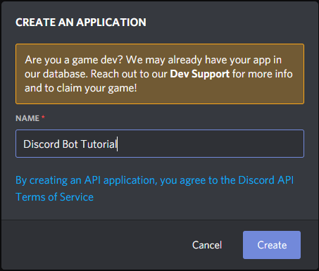

**You've made it!** You've joined Discord and now you want to spice things up a bit and create a Discord Bot, perhaps this is even your first time working with NodeJS, or even _your first time writing code at all._

**Before** we get started, I'd like to mention that before you create a public application, or even a private one - you should have at _the very least_ a basic understanding of how the language you are using works. You can't write code without knowing the basics.

If you are wanting to hop right into making a bot, I **strongly advise** that you visit the following websites to learn some of the basics first:
- [w3schools](https://www.w3schools.com/nodejs/default.asp)
- [codecademy](https://www.codecademy.com/learn/learn-node-js)
- [javascript.info](https://javascript.info/)

I'm going to hope you listened, and at least _skimmed_ the basics on the sites above. 
___
## Setting up the Environment

**Before** you can get started with anything, you need to make sure your environment is setup correctly. By this, I mean you need to make sure that your desktop, or laptop - has the programs required to code, and run code with NodeJS.

If you haven't already, install the following:
- [NodeJS 12+](https://nodejs.org/en/download/)
_**Note:**_ _We will be using Visual Studio Code for this tutorial, but feel free to use any code editor you like._
- [Visual Studio Code](https://code.visualstudio.com/download)

Once you have those installed, continue on by creating a new folder.

I'll be naming my folder `DiscordBot` - Go ahead and open that folder in Visual Studio Code. To begin creating a project with NodeJS we will be using the [_Package Manager_](https://en.wikipedia.org/wiki/Package_manager) NPM. 

We now need a Terminal to use. Type **Ctrl+`** to open a new one in Visual Studio Code.

To get started with a new application, we want to _initalize_ it! This helps us keep track of packages and dependencies, along with some other tid-bits we will use later on. Go ahead and run 
```bash
npm init -y
```
And you are all set. Now we need to install Discord.JS

```bash
npm install discord.js --save
```
This will install Discord.JS and all of it's dependencies.

## Creating a Discord Application (Discord Bot User)

Before you can work on the code for the bot, you have to get a bot user from Discord first.

Go to [discord.com/developers/applications](https://discord.com/developers/applications) and create a new application.

It _should_ look like this, **if** it doesn't - you may have a popup blocker removing the popup. Toggle it off and try again.

**After** clicking "create" you will see a sidebar that has a "Bot" tab, click that, and click the "Add Bot" button.

Now, you need to invite your bot to a server! Add it to a server by generating an invite link [here](https://discordapi.com/permissions.html#8)
___
## Ready, Set, Code!
**Now** we get to begin coding the basic bot! 

Let's create a new file called `index.js` and start by writing the following code. 
I've added comments to the code to explain each part.
```js
const Discord = require("discord.js")
const Client = new Discord.Client({
    fetchAllMembers: false, // Don't ask Discord for all discord users your bot is in at one time.
    disableEveryone: true, // Don't allow the bot to ping @everyone.
    disabledEvents: [], // This is important, but for now, we can safely ignore it.
    http: { api: 'https://discordapp.com/api', version: 7 }, // Sets the API version.
    shardCount: 1 // Don't worry about this, it basically says you only want **one** copy of your bot!
});
```
So you've created a bot now! Congrats! Only issue is... right now it doesn't log in. Let's fix that!
- First, you will need to go back to your bots application page. Remember how it said "Token" on the page? 
- Copy that token and paste it where I have `TOKEN_HERE`

```js
Client.login("TOKEN_HERE")
```
Now your bot can login. Normally, you would keep your token stored in a Configuration file, but this is fine for now.
To connect your bot to Discord, in the terminal use the following command:
```bash
node index.js
```
You should now see your Bot come online in your server!
___
## Making the Bot Functional
So you have a bot, but it doesn't do anything yet! Once again, let's change that!

Discord sends `events` to your bot that let it know when something happens, or when someone does something. We will be using the [message](https://discord.js.org/#/docs/main/stable/class/Client?scrollTo=e-message) event to get and read user messages.
Taking the code from before, add the following lines to it. I've explained what the code does in the comments.
```js
Client.on("message", msg => { // when the Discord sends the bot a message, run this code
    if(msg.content === "hey!") { // checks if the message content equals "hey!"
        msg.channel.send("hey cool person!") // sends a message in the current channel
    }
})
```
Go ahead and relaunch your bot if you haven't already. Go ahead and send "hey!" in a channel!
Your bot should have responded with "hey cool person!" if all went well.
___
## Congrats!

You now have a functioning Discord Bot that responds to a word. Try messing around with the small amount of code you have and see if you can make it do more!

For more functions of discord.js, check the [documentation here](https://discord.js.org/). If you feel confident enough, try adding some other events, or using different functions of Discord.JS. Below should be your final code from the tutorial, if anything went wrong, try examining it to see what you did differently!

Once you get the hang of things, you can try and work with the more advanced example on the site. I will warn you, if this was difficult, it will be **much** harder to understand the advanced example, but it may help to view the code and see syntax, and other functions of Discord.JS, and NodeJS itself. Once again, if this was difficult, go through the resources listed at the top of the tutorial and come back when you are finished. It will take time, but it will be worth it, and save you time in the long run.

```js
const Discord = require("discord.js")
const Client = new Discord.Client({
    fetchAllMembers: false,
    disableEveryone: true, 
    disabledEvents: [],
    http: { api: 'https://discordapp.com/api', version: 7 }, 
    shardCount: 1 
});
Client.on("message", msg => { 
    if(msg.content === "hey!") { 
        msg.channel.send("hey cool person!")
    }
})
Client.login("TOKEN_HERE")
```


